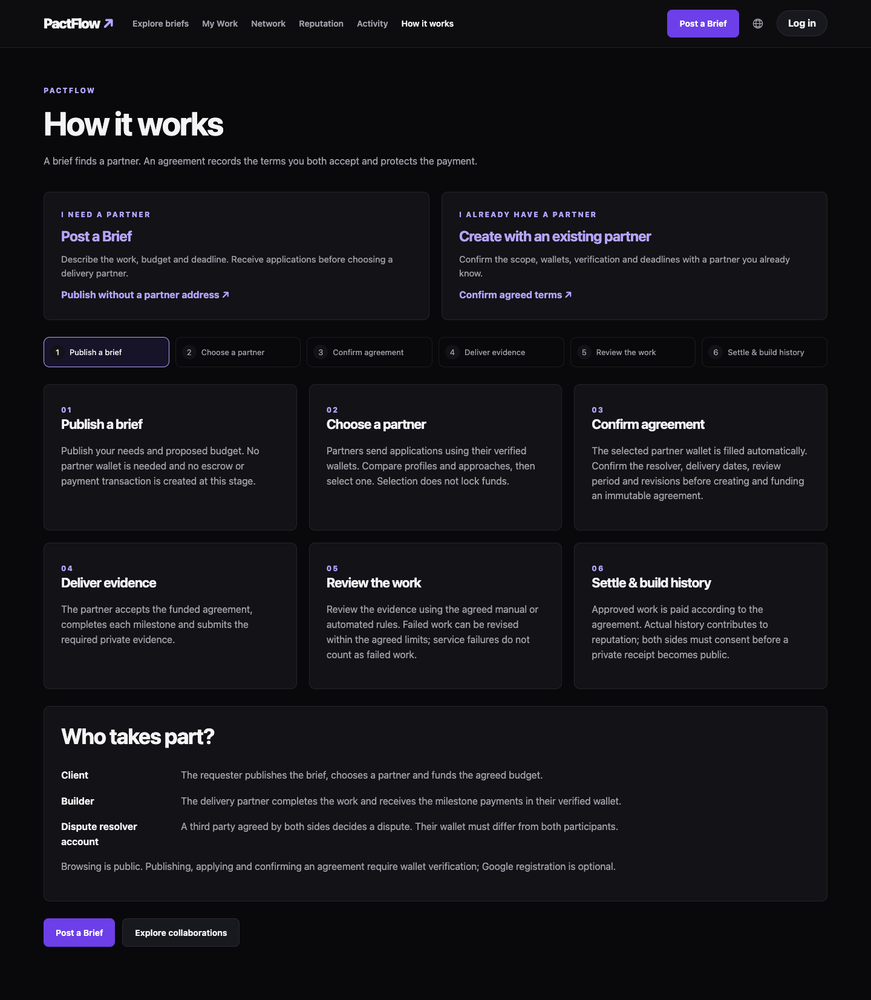

<p align="center"></p>

# PactFlow

PactFlow connects clients and collaborators through escrow, verified delivery, and real reputation, making work and payments more trustworthy.

Publish a brief → Select a partner → Agree on milestones → Secure payment → Verify delivery → Build reputation.

## What you can do

- Publish a work brief, receive applications, and select a partner before creating an agreement. Known partners can create an agreement directly.
- Confirm milestone amounts, deadlines, acceptance rules, revisions, and participant wallets before locking funds.
- Submit private evidence, inspect verification reports, revise failed work, and settle accepted milestones through smart contracts.
- Follow real activity and delivery history in a Work Passport; share a redacted receipt only with both participants' consent.
- Use English or Chinese on desktop and mobile. Wallet access is required for protected actions; optional Google identity is separate from wallet authority.

See [the product journey](docs/PRODUCT_JOURNEY.md), [hackathon submission copy](docs/HACKATHON_SUBMISSION.md), and [validation evidence](qa/evidence/VALIDATION.md).



## Current status

[PactFlow](https://pactflow-lovat.vercel.app) is hosted on Vercel and connected to the API on a separate Aliyun server. V2 contracts are deployed on Monad Testnet; a real manual-acceptance workflow has settled test USDC. AI semantic review and Google sign-in require their respective service credentials. See [Vercel deployment](deploy/VERCEL.md).

V1 contracts and deployment records remain available; new revision-capable Pacts use separately configured V2 contracts. These identifiers describe contract compatibility, not the product name. Local chain acceptance and a public testnet settlement have been verified. Broader production acceptance remains subject to the configured services and recorded checks. See [production audit](qa/PRODUCTION_AUDIT.md).

[Download the transparent PactFlow logo](assets/brand/pactflow-logo.png) for the hackathon submission (1254 × 1254 PNG, under 2 MB).

## Local acceptance

Use Node 24, pnpm 11.25.0 and Monad Foundry. Install with `corepack pnpm install --frozen-lockfile`; run `sh scripts/bootstrap-foundry.sh` for the pinned contract test library.

Start Anvil in its own terminal:

```sh
anvil --host 127.0.0.1 --port 8547 --chain-id 10143 --block-time 1
```

Then from this independent directory:

```sh
corepack pnpm local:deploy
corepack pnpm local:services
```

Open http://localhost:3011. The helper uses a new private local database and generated test wallets, deploys V2 only on loopback Anvil and mints valueless test tokens. Generated `.local` files contain private keys and must never be uploaded or reused publicly. Browser tests inject signing through their Node process; keys do not enter browser code.

In another terminal:

```sh
corepack pnpm typecheck
corepack pnpm lint
corepack pnpm format:check
corepack pnpm test
corepack pnpm test:contracts
corepack pnpm test:e2e:local
```

Production build: stop local Next dev before `corepack pnpm build`. Real PostgreSQL/Redis integration tests run only with `TEST_DATABASE_URL` / `TEST_REDIS_URL` pointing at dedicated loopback test services; skipped tests are not passes. CI provisions both services and runs local-chain browser acceptance without public-chain broadcasting.

## Production and protocol

New agreements use the configured platform dispute resolution wallet (`NEXT_PUBLIC_ARBITRATOR_ADDRESS`, default `0x786e6F51E928286D35084129f359c6fEa391357E`) without asking participants to enter it. It must differ from both participants. Existing agreements retain their locked arbitrator. This wallet resolves disputes; it does not custody the milestone budget. Normal manual acceptance is signed by the requester, and the escrow contract pays the worker directly. Automated acceptance uses the verifier configured in the contract, which is a separate role.

[Linux Compose setup](deploy/README.md) covers PostgreSQL, Redis, private objects/scanner, separate worker, Envio and TLS, backups and restore checks. Public V2 deployment is an explicit operator command (`deploy:v2:testnet`) using funded local credentials; it validates and records fresh contracts without replacing V1. Do not run it as a local or CI prerequisite.

Read [product source of truth](product/PRODUCT.md), [dependency graph](product/P0_DEPENDENCIES.md), [state machine](specs/pact-state-machine.md), [API contract](specs/api-contracts.md), [acceptance matrix](qa/E2E_MATRIX.md) and [judge demonstration](qa/JUDGE_DEMO.md). Original V1 instructions are retained in [README-V1](docs/README-V1.md).
