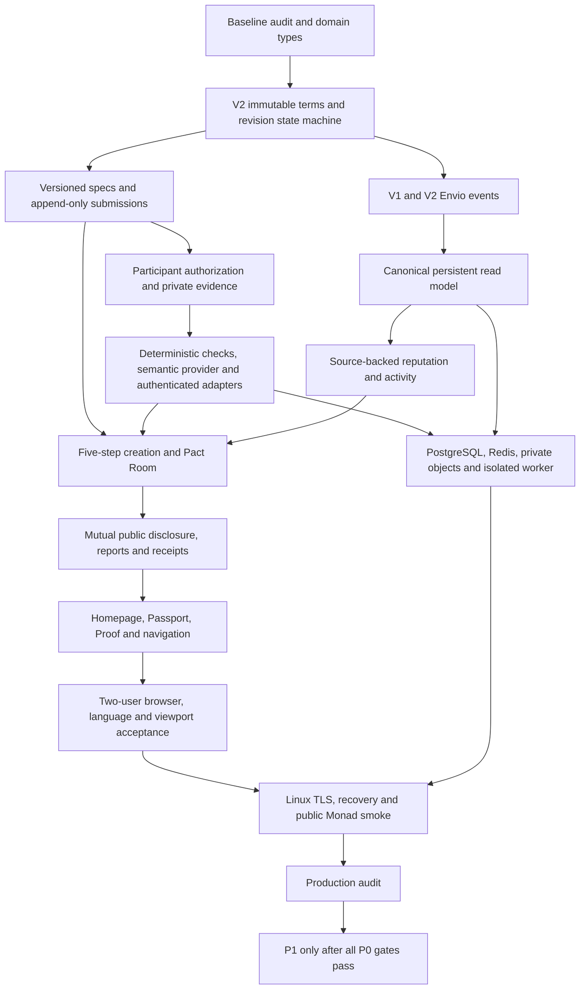

# P0 dependencies and evidence

This is an execution graph, not a completion claim. External gates remain open until their real environments pass.

| Dependency       | Implementation evidence                                                       | Acceptance boundary                                                                                                                 |
| ---------------- | ----------------------------------------------------------------------------- | ----------------------------------------------------------------------------------------------------------------------------------- |
| Baseline/domain  | baseline commit; `packages/shared/src/domain.ts`; `packages/sdk/src/state.ts` | Original files retained; protocol and processing states separated                                                                   |
| Protocol         | `packages/contracts/src/v2`; SDK/ABIs; V1 preserved                           | Foundry behavior, replay/funding fuzz and invariants; public V2 deployment still unavailable                                        |
| Data/privacy     | Drizzle 0002/0003; trust/upload routes                                        | V1 migration, session revocation, immutable hash, private evidence and concurrent claim tests; real PostgreSQL/storage run required |
| Verification     | normalize/check/provider/aggregate/report/attest pipeline                     | Local signed false→revision→true→settlement; real external credentials required for provider smoke                                  |
| Index/reputation | Envio handlers; keyset ingestion; atomic projector/reputation rebuild         | Event replay/reorg projection tests and local RPC flow; production GraphQL runtime required                                         |
| Product          | Wizard, Pact Room, TrustPanel, Activity/Passport/Receipt/Proof                | English/Chinese real local wallet flows and seven viewport checks                                                                   |
| Production       | Dockerfile/Compose/CI/deploy scripts                                          | Host lacks Docker and public deployment credentials; not release ready                                                              |

The queue and read model are developed before complete page acceptance because permissions, proof binding and freshness must be available to the UI. Local RPC is explicitly marked development-only. P1 stays gated by the external P0 checks rather than being presented as completed.
