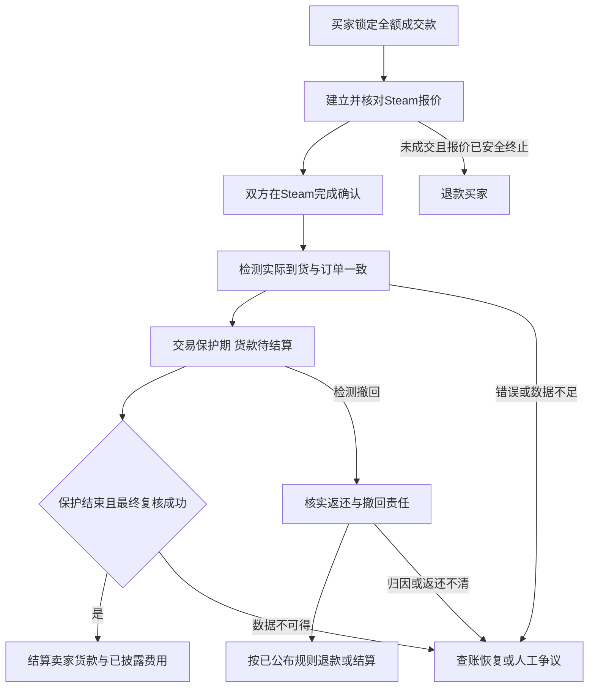

# Steam 饰品交易平台：BUFF 机制、自动验货与 Monad 结算

补充研究日期：2026 年 10 月 2 日（北京时间）。

本次方向：你希望做 Steam 饰品交易平台，参考网易 BUFF，普通买卖双方不额外缴保证金，不把上传发货截图作为交易步骤。原方案中的通用品类比较保留作背景；本补充作为当前产品方向与实现优先级的依据。

## 1. 结论：普通现货交易可做成零额外保证金，但货款必须受到约束

推荐首期聚焦 **CS2 现货饰品 P2P 交易**：买家只付成交款，卖家不额外存押金；饰品在 Steam 内直接从卖家转给买家；平台自动核验交易；货款等实际交易保护期结束且再次核验后释放。正常流程不要求截图，异常仍保留客服处理。

这一判断修正了原方案对“Steam 饰品不作首发”和“卖家保证金”的默认建议。**保证金不是普通现货模式的必要组件；买方已付货款的完整保护、卖方延迟结算和准确的撤回处理才是核心。**如果要提前提现、预售、租赁或额外赔偿承诺，风险覆盖另行设计。

技术可行性与商业准入仍分开：饰品权利在 Steam；Monad 处理订单和资金，不能强制 Valve 发货或禁止撤回。大陆用户的真实稳定币结算约束不因参考 BUFF 消失；大陆商业版仍需核实适用法币支付渠道和商品准入。本补充不重复原报告的政策全文。

## 2. 调查范围与证据边界

本次读取了用户提供的 Steam 交易保护 FAQ，并核查 Valve 官方接口文档、API 条款、BUFF163 官方公开帮助和 BUFF Market 国际版 FAQ。

BUFF163 的帮助内容由研究协作者在访问限制出现前从匿名公开页面取得；没有登录、查看用户订单或取得内部代码。之后直接浏览被站点安全策略阻止，已停止对该域名的后续请求。以下注明的 BUFF163 规则依据此前已取得的官方资料；未取得的详情不作推断事实。国际版规则单独标明，不能替代大陆版。

本文区分：**官方规则事实、基于规则的机制解释、建议实现、尚需真实账户联调的行为**。不会把“能解释 BUFF 用户体验的设计”冒充已经逆向确认的 BUFF 后端实现。

## 3. Steam 保护期对平台意味着什么

用户提供的 [Steam 中文官方 FAQ](https://help.steampowered.com/zh-cn/faqs/view/365F-4BEE-2AE2-7BDD)说明：CS2 交易物品立即到账，但接收后 7 天仍受交易保护，期间不能再次转移、消耗或修改；期满后这一交易保护撤回能力结束。目前此规则覆盖 CS2，不能直接推广到 Dota 2、TF2 等全部 Steam 游戏。

任一交易参与方都可能发起撤回；它影响该账号过去 7 天内全部受保护交易，并带来发起者 30 天交易及社区市场限制。CS2 现行保护机制与旧的 trade hold/escrow 不同，不能混用旧“令牌开启后消除等待”的解释。[Steam 官方交易保护说明](https://help.steampowered.com/zh-cn/faqs/view/365F-4BEE-2AE2-7BDD)

据此，平台应分别记录 **报价发出、交易完成到货、仍可撤回、最终满足结算条件**。7 天从 Steam 实际交付节点计算，不能从买家付款或平台下单时起算。一次撤回可能影响多笔订单，因此需要按关联 Steam 账号回查其他保护中订单。

## 4. BUFF 怎样实现用户熟悉的体验

### 4.1 普通流程无需发货截图

已取得的 BUFF163 官方发货帮助显示，平台支持买家发报价、卖家接收，以及“请卖家发报价”两种方向；不是所有订单都由卖家发起。发出报价、确认令牌但对方未接收，仍不等于交易完成。普通发货步骤没有上传截图要求，截图出现在异常客服排查场景。[BUFF 卖家发货流程](https://buff.163.com/help#how_to_sell_cosmetics_new)、[报价方向说明](https://buff.163.com/help#N_send_offer_by_seller_new)

这说明平台以订单关联的 Steam 交易检测驱动状态，正常履约可以不依赖用户手工证明；具体调用哪个接口、如何识别撤回、是否还有内部辅助机制，帮助页没有公开。[BUFF 新手问题](https://buff.163.com/help#N_newbie_faq)

### 4.2 没有另交押金，不等于没有锁款

大陆 BUFF163 钱包 FAQ 明确 CS2 成功交易后的货款在 7 天保护期后结算。BUFF Market 国际版另明确货款保留约 7–8 天，时间取决于饰品保护结束和系统状态更新。[BUFF163 钱包 FAQ](https://buff.163.com/help#buff_wallet_faq_new1)、[BUFF Market 国际版 FAQ](https://buff.market/faq)

解释普通模式时应区分三个概念：

| 概念 | 谁提供资金 | 目的 | 首期设计 |
|---|---|---|---|
| 买方成交货款 | 买家 | 购买商品，并在交付期间保留可结算/可退款的本金 | 必需，全额支付并保护 |
| 卖方额外保证金 | 卖家 | 补偿违约、价差或提前放款风险 | 普通现货不默认要求 |
| 平台垫资或可用信用 | 平台承担信用/流动性风险，或维护站内债权 | 让卖家提早使用待结算收益 | 首期省略 |

例如成交价 100：买家支付 100，饰品交付到买家 Steam 账号，卖家获得一笔待结算收入。观察期内，交易正常则等到期结算；发生确认的撤回则按原因处理货款。这里保护本金的来源是买家已付的 100，而不是卖家另押 100。

### 4.3 BUFF 的规则并非所有功能都无保证金

本项目普通现货可设计成不另缴保证金；已读 BUFF 普通流程未列统一保证金要求。官方撤销准则同时列有缴发货保证金的特定普通订单，预售、急售也有保证金规则，因此不能断言“BUFF 所有普通订单都免保证金”。特定普通订单保证金是否可选、触发条件和额度没有取得，不在本报告中编造。[BUFF 撤销处理准则](https://buff.163.com/help#reversal_rules)、[预售 FAQ](https://buff.163.com/help#N_Pre_Sale_FAQ)、[急售 FAQ](https://buff.163.com/help#N_auction_faq)

不交额外押金也不意味着买家无成本退出。大陆版撤销准则区分卖家撤回、买家撤回和待结算余额支付：普通款项支付的买家主动撤回，订单仍结算卖家；卖家撤回涉及封禁和恢复账号前赔偿；含待结算余额的订单另有回溯处理。这些都是资金与责任规则，不是 Steam 自动给平台赔钱。[BUFF 撤销处理准则](https://buff.163.com/help#reversal_rules)

卖家的取消率、超时和发货表现还会影响交易资格。信誉处罚减少重复违约，但无法保证卖家离开平台后仍会付赔偿。[BUFF 卖家管理规则](https://buff.163.com/help#N_sellers_rules_new)

### 4.4 待结算收益能继续购买，不等于可以提现

大陆版准则提到包含待结算余额的组合支付，证明存在这类站内消费场景；完整资格、额度和顺序未取得，不承诺所有用户都可用。[BUFF 撤销处理准则](https://buff.163.com/help#reversal_rules)

从机制上推断，站内余额可被平台关联到上一笔收入来源，并在撤回时回溯处理。这个解释不是 BUFF 内部会计系统的已确认实现。开放链上转出的稳定币通常无法由你的平台收回，因此不能把站内信用照搬成“到账即能提现的链上资金”。

“信用秒到账”的当前准入、提现和追偿详情未核实。首期直接采用延迟最终结算，避免同时实现信用垫资和多级资金回溯。

## 5. 自动验货是不是用 Steam API

**可以使用 Steam 提供的交易数据做自动核验，但不能直接声称 BUFF 只靠公开 API 或单个 API Key 完成整个流程。**

BUFF163 当前专门交易设置帮助说明，Steam 更新后已不需要设置 API Key；较旧新手 FAQ 仍有旧指引。这是帮助文案存在新旧口径的例子，应优先参考当前专门设置说明，不能默认要求每个用户交出 API Key。[BUFF Steam 设置](https://buff.163.com/help#N_steam_setting_new)

BUFF Market 国际版 FAQ 在状态更新流程中明确提到重新登录、刷新 cookie 和更新订单。这证明至少国际版部分状态更新依赖授权登录状态，不能推导其全过程就是匿名公共库存查询，也不能据此取得大陆版全部权限设计。[BUFF Market FAQ](https://buff.market/faq)

### 5.1 必须区分四种能力

| 能力 | 用途 | 不应误认为 |
|---|---|---|
| Steam OpenID 登录 | 验证用户控制哪个 Steam 身份 | 自动取得私人库存、报价与交易历史权限 |
| Trade URL | 找到可以发报价的对手方 | 证明已发货、证明账号所有权或取得历史读取权限 |
| 有权读取的交易/库存数据 | 校验报价、对手方、资产和交易结果 | 能自动接受报价、确认令牌或保证永久可访问 |
| 发起/接收报价和移动确认 | 让 Steam 执行物品转移 | 由只读接口或链上合约直接替代全部用户授权 |

Valve 官方说明 OpenID 返回并验证用户 SteamID；私人数据和受保护接口还需相应认证。身份登录不能替代交易读取授权。[Valve 身份认证文档](https://partner.steamgames.com/doc/features/auth)

### 5.2 官方文档已确认的读取接口

[Valve IEconService 官方文档](https://partner.steamgames.com/doc/webapi/IEconService)明确列出：

| 接口 | 用途 | 本方案使用方式 |
|---|---|---|
| `GetTradeOffer` | 查询指定报价 | 核对绑定报价及状态 |
| `GetTradeOffers` | 查询账号发出/收到的报价 | 寻找订单关联报价，检测变化 |
| `GetTradeHistory` | 查询账号历史交易 | 对账实际交易及结果 |
| `GetTradeOffersSummary` | 查询报价数量摘要 | 辅助刷新提示，不能作为到货证据 |

该页列出用户认证 key，但没有完整披露当前交易保护响应字段和撤回判定，也未在已读取页面中列出 `GetTradeStatus`。因此没有把第三方库的 `11/12/13` 等数字状态写成 Valve 官方已确认的结算规则。

接口名称存在，不代表你的平台已获得查询任意用户私人交易的权限。真正需要先验证的是：用户可以怎样合规授权；在保护期内是否读得到订单必需数据；能否可靠区分成功、撤回和暂时不可读；授权撤销后如何处理。

Steam 公共库存网页或接口不应成为唯一事实来源。保护期可见性、缓存、资产标识转移后的变化和响应格式，应在真实授权环境下实测；没有账号联调就不能把它们当作已解决。

### 5.3 权限设计是第一项技术门槛

Valve API 条款要求保护 API 密钥、按用户请求读取其数据、说明非公开数据保存情况，并禁止截取或存储用户登录密码；接口可能改变或终止。**首期不能把“让用户粘贴 API Key、Cookie 或移动令牌密钥”作为未经核实的标准方案。**应先确认官方允许的授权和读取方式及所需权限。[Steam Web API 条款](https://steamcommunity.com/dev/apiterms)

尽量让用户在真正的 Steam 页面完成登录与交易确认，平台不接收密码或令牌密钥。若实现自动检测需要会话凭据，它们属于敏感访问权限，必须明确授权范围、保管和撤销机制；即使技术上能调用，也要确认条款与安全边界。研究阶段没有读取任何人的凭据。

## 6. 你应怎样设计无需截图的自动验货

下面是建议实现，不是 BUFF 后端已确认设计。

### 6.1 订单关联与物品身份

订单固定买卖双方 Steam 身份、钱包、商品、价格和收货方向；用户签署绑定关系。Steam 登录和钱包签名共同绑定账号，避免随意填别人的 Steam ID。

记录 `orderId`、`tradeOfferId`、可取得的 `tradeId`、双方身份、游戏/上下文、资产实例和数量、报价方向、相关时间与状态。资产在交易前后若改变标识，需要以交易记录建立新旧映射；能否取得对应字段属于联调验收项。

同一笔实际 Steam 交易只允许履约一个平台订单：验证服务唯一登记报价/交易与订单的关系，合约检查不可重复使用的交易承诺。只防“回执编号重复”不够，不能通过换一个回执号重复结算同一交易。实际成交必须对应当前订单锁款确认后的履约，不能用下单前已完成的历史交易；若时间精度不足以判断，须补强订单关联证据，不能只按近似时间匹配。

不能只按皮肤名称核验。相同名称可能有不同磨损、模板、贴纸或其他价值属性，订单要绑定具体实例。若有需要核验的附加属性且不能可靠取得，首期应限制支持范围，而不是在成交后争论截图。

同时检查报价没有夹带买方其他物品：对于纯货款购买，买方 Steam 物品出让集合应为空，卖方出让集合应与订单一致。Steam 报价方向与平台“买/卖”角色不同：买家也可以发起要求接收卖家物品的报价。

### 6.2 检测服务

建立 `SteamDeliveryVerifier`：它只负责在已获适当权限的前提下获取并核对交易事实，不自行决定付款规则。

检测工作包括：报价关联、实际接收、对手方匹配、具体资产匹配、保护期起止、撤回状态和最终复核。没有确认的数据标为未知；不要将 HTTP 成功、库存暂时不可读或报价消失解释成履约成功/失败。

Steam 文档未确认此类交易存在供你使用的 webhook，所以按可用接口采用轮询与对账。对活跃报价短间隔、保护中订单低频、临近到期重点复核，结合按账号批量查询及增量分页，避免逐订单高频请求。实际频率由权限、配额和测试结果确定，不把公开 API 当无限容量。

### 6.3 链上验证与信任边界

Steam 不会直接给 Monad 合约签发链上履约证明。验证服务将核验结果签名提交，合约检查签名、订单绑定、新鲜度、阶段和是否已使用，再执行货款规则。

回执包含订单、链和托管合约、双方绑定身份承诺、报价/交易标识、资产承诺、状态、观察时间、确认的保护结束条件、唯一回执号及规则版本。真实账户数据和凭据留在受控链下存储，链上只保留最小必要承诺。

初期合约信任平台验证服务；未来多签或多个验证节点可降低单密钥风险，但大家读取同一 Steam 来源并不能消除 Steam 本身的依赖。界面应让用户看到状态来源和最近核验时间。

## 7. 无额外保证金的完整资金与状态流程

初始原则：**买家全额付款；卖家保护期内不能提现；正常到期结算；撤回按实际原因处理；数据不明时不自动放款或判罚。**

这里的“等待 7 天”只是最低必要窗口。应根据真实交付节点、Steam 当前状态及传播延迟结算；BUFF 国际版的约 7–8 天是运行规则参考，不能当你已经实现了精确自动终局判断。

### 7.1 正常成交

付款确认后允许建立订单关联报价；实际到货进入保护中；期满重新检查交易没有被撤回，再结算。买方提前点确认不绕过仍然存在的撤回风险。观察期内不提供卖家可随意链上转出的信用余额。

### 7.2 卖家不发货

发货超时，先确认报价不存在、已取消/失效或不会再完成。仍在途中或状态不明就先停止新发货、对账和解决异常，避免退款后报价迟到成交。Steam 不可用不自动计入卖家恶意违约；确实未履约才退款并记录发货表现。

### 7.3 卖家主动撤回

确认饰品回到卖家及关联订单后，冻结相关待结算款，按规则退买方本金；卖家的额外违约补偿需要可执行来源。首期不承诺无押金情况下必定即时赔付买家价格上涨差额。

封禁、实名关联和追偿能够降低重复作恶，无法凭空产生赔付款。若卖家放弃账号，买家本金保护与额外赔偿是两项不同承诺。

### 7.4 买家主动撤回

Steam 会把饰品返回卖家，但平台货款如何走由平台条款和适用规则决定。不能对所有主动撤回默认全额退款，否则买家得到一个可根据价格涨跌选择退出的 7 天机会，卖家承担时间与价格风险。

BUFF 部分规则选择继续结算卖家；这不应未经评估直接照抄。新平台应区分恶意违约、盗号救济、平台故障和无责取消，明确是否及如何从已付货款扣合理补偿，并保留申诉。拟定规则时评估公平性、可执行性和用户是否理解。

### 7.5 任一方因其他交易发起整体撤回

一个订单被回滚，不一定代表它就是作恶对象；盗号受害者的安全恢复可能连带正常订单。按账号回查全部保护中交易，分开记录撤回事实、发起者和责任判断。API 未提供足够归因时交人工核查，不根据资产消失、30 天限制或单方陈述直接罚款。

### 7.6 接口故障或授权失效

暂停受影响自动结算，提示恢复必要授权，允许查账和有时限人工处理。不因缺数据向买家自动退款，也不因时间到期向卖家自动放款。数据永久缺失时，合约无法自行判断客观事实；需要事先约定的受约束裁决或双方一致授权处理。

### 7.7 期满买家已经转卖

期满后买家可合法转移物品，所以最终复核不能要求“物品此刻仍在买家库存”作为唯一通过条件。应核对原交易与撤回记录。库存缺失可能是后续合法交易，不能据此退款。

## 8. 可以省掉什么，不能省掉什么

| 项目 | 首期决定 | 原因 |
|---|---|---|
| 双方额外押金 | 普通现货省掉 | 全额货款保护覆盖该笔本金 |
| 正常发货截图 | 省掉 | 自动核对交易数据 |
| 平台饰品机器人仓库 | 省掉，采用 P2P | 减少额外移交和库存托管；仍须双方确认 |
| 买方全额付款 | 保留 | 为结算与退款提供本金 |
| 保护期内货款限制 | 保留 | 覆盖可撤回风险 |
| 用户适当授权与账号绑定 | 保留 | 无权限无法可靠核验私人交易 |
| 人工异常处理 | 保留 | 接口故障、盗号、归因和附加属性争议 |
| 信誉及交易限额 | 保留 | 减少取消、重复作恶与集中风险 |
| 秒提现、信用购买、预售、租赁 | 延后 | 增加垫资、资金链回溯与赔偿敞口 |

## 9. 提前放款为什么是另一项业务能力

若卖家保护期内提现真实资金，而饰品后来被撤回，买方仍需要退款。原货款已给卖家，就需要平台自有风险资金、可靠担保或实际可执行追偿。不能同时将一笔钱视作“卖家已提现”和“仍保留的退款本金”。

假设日成交金额 10 万元，80%提前放款，平均 8 天最终结算，约有 64 万元交易处于提前付款敞口。这是解释风险规模的假设，不是 BUFF 财务数据；实际还需要流动性、集中撤回及欺诈缓冲。

有些平台显示秒到账但限制提现或只提供站内购买信用，所以产品必须区分待结算收入、可消费额度、可提现资金与最终结算。首期不做信用秒到账；未来只给经过验证的卖家小额、可暂停额度，并独立验证收益是否覆盖风险。

## 10. 首期商品与撮合范围

明确选择 **CS2、单件可交易现货、一口价、卖家库存内物品、普通 P2P 交付**。先不支持预售、租赁、批量混合报价、跨游戏物品、账号和兑换码。特殊磨损、贴纸或模板需能可靠绑定实例，否则限制商品。

前台展示商品、售价、Steam 交易方向、卖家发货表现、预计到货与货款解锁规则。搜索排序和买卖意图发现可以在链下完成；Monad 合约验价、锁单和托管，不必先做复杂订单簿。

每笔饰品上架与 Steam 资产实例绑定。成交时锁定平台订单，检测资产是否仍可交易。平台内锁单不能阻止卖家在其他市场再次出售，需接受此类订单失败并按确认未履约流程退款。不要将链上订单锁定宣传为锁定了 Steam 库存。

Monad 不能把 Steam 饰品本身搬到链上；商品仍按 Steam 规则流转。将订单收据铸成 NFT 不应让用户以为持有收据就能强制提取原饰品。

## 11. 必须先做的联调验证

本研究没有登录 Steam、取得私人交易记录或执行真实饰品交易。以下仍是开发前的验证任务：

| 验证项 | 通过条件 | 失败影响 |
|---|---|---|
| 合适的用户授权方式 | 能在允许范围内取得所需数据，不收集密码/令牌密钥 | 不能承诺全自动验货 |
| 精确报价绑定 | 确认双方、方向、实例、数量并关联平台订单 | 可能把别的交易当本订单履约 |
| 保护中数据可读 | 有可靠依据证明物品已交付，即使公共库存不可见 | 不能仅靠库存变化检测 |
| 撤回识别与资产返还 | 区分成功、回滚、未知，记录关联订单 | 不能安全自动放款/退款 |
| 保护结束判断 | 用真实交付时间及终态复核，处理边界延迟 | 单纯 7 天定时器不够 |
| 授权撤销与服务宕机 | 不误退款、不误结算，有恢复与裁决路径 | 可能造成资金或商品双损 |
| 双市场重复出售与资产换号 | 可检测失败并正确对账 | 上架不代表库存已锁 |
| 接口条款、配额和商业使用范围 | 授权路径及调用安排适用 | 技术可用不等于可运营 |

至少演示：正常成交、超时安全取消、卖方撤回、买方撤回、无效/旧证明复用、API 故障、期满已合法转卖。撤回属于 Steam 真实安全功能，不应为 Demo 随意让用户触发其真实 30 天限制；用明确标注的回放或模拟数据验证异常分支。

如果要在本届黑客松前完成真实 7 天窗口验证，应及早启动测试者自愿、适当授权的受控流程；真实 Steam 7 天不能靠调合约时间缩短。Demo 可用模拟时钟展示结算，但必须标注模拟，并区分真实只读数据与模拟撤回事件。

## 12. 对当前方案的最终调整

1. **产品方向改为 CS2 饰品现货 P2P 市场。**保留其真实交易需求及成熟用户习惯，不再把它排除为首发。
2. **普通模式取消额外保证金模块。**采用买方全额货款保护、保护期后结算及账户风险限制。
3. **用自动交易数据核验代替截图步骤。**先验证权限和撤回检测；异常客服仍存在。
4. **Monad 承担资金规则与可核验订单记录。**Steam 负责饰品实际转移，平台验证服务连接两者。
5. **暂不复制 BUFF 的待结算余额循环消费。**它涉及平台信用与多笔资金回溯，不等于可自由转出的稳定币。
6. **真实大陆业务先确认支付及商品经营路线。**Steam/BUFF 履约机制研究没有取消原报告的支付约束。

首个技术验收问题应是：**能否通过合适的授权方式，稳定取得一笔具体 CS2 交易的到货、撤回及保护结束证据？**这个问题通过后，零额外保证金的托管结算逻辑并不复杂；若证据路径不成立，链性能无法补足它。
