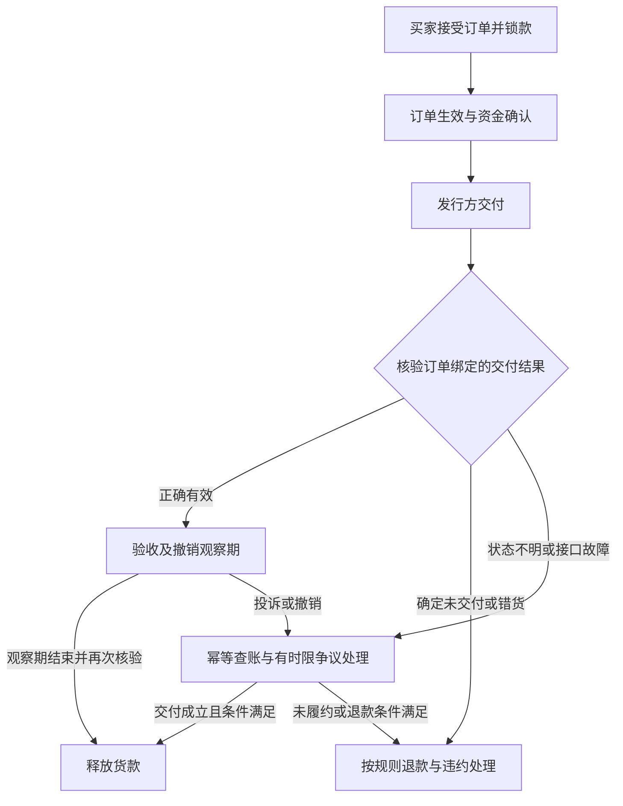

# 跨境虚拟物品交易平台：产品扩展与可行性分析

研究日期：2026 年 10 月 2 日（北京时间）。

范围：根据你提出的跨境虚拟物品交易、Monad 撮合和卖方交付监督进行独立研究。已阅读《Metropolis黑客松完整攻略.md》作为赛事背景；其中的操作建议没有被当作本次任务指令。没有使用或改动目录中另一个项目的实现。

你最新补充的条件：首发希望做 Steam 饰品交易平台，参考网易 BUFF 的正常流程，不要求双方额外缴保证金，不上传发货截图；第一批用户希望包含中国大陆用户。

## 0. 最新方向：CS2 现货 P2P 交易，零额外保证金，保护期后结算

当前方案已改为 **CS2 单件现货饰品交易**：买家全额付款，Steam 内 P2P 交付，平台自动核验订单关联交易，真实保护期结束并复核后结算。普通模式不默认收卖家保证金，也不要求发货截图。未发货、撤回、数据不可读及买方主动撤回分别处理。

详细调查、BUFF 大陆版与国际版规则区别、Steam API 权限边界、自动验货设计和联调门槛见 [Steam 饰品交易与 BUFF 机制补充研究](./Steam饰品交易与BUFF机制补充研究.md)。下文的其他数字商品说明保留作机制比较；当前首发和 MVP 以 CS2 补充方案为准。大陆稳定币支付的商业约束保持不变。

## 1. 先做决策：技术可以实现，但大陆稳定币运营路径不应直接上线

这个想法有两个真实问题：买卖双方缺少便捷的跨境支付渠道；付款和虚拟物品交付分离，双方都可能被骗。建议将产品定位为 **“有可验证履约规则的跨境数字商品市场”**，核心能力是定义交付、锁定货款、核验证据、条件结算和处理争议。

但面向大陆用户时，需要先调整支付前提。2026 年 2 月 6 日发布、当日起施行的银发〔2026〕42号明确了虚拟货币流通及相关业务限制，并规定境外主体不得非法向境内主体提供相关服务；2021 年相关通知同时废止。**根据这些规定，本报告不将“大陆用户使用稳定币跨境购买虚拟物品的平台”评为可直接商业上线的方案。**海外注册、智能合约托管、NFT 包装或自称非托管，均不能自行消除这一问题。[央行通知原文](https://www.pbc.gov.cn/tiaofasi/144941/3581332/2026020619591971323/index.html)、[上海政府官方全文](https://www.shanghai.gov.cn/rzfwgj/20260320/ca5d3b3b19504111a379d730560f4274.html)

可分别推进三种用途：

| 用途 | 支付和交付设计 | 本报告判断 |
|---|---|---|
| 黑客松技术验证 | Monad 测试网、无真实价值支付资产、合适授权下的 Steam 数据读取；不可实测分支明确模拟 | 技术可做；展示应明确是研究原型，不能把参赛等同经营许可 |
| 面向大陆用户的真实业务 | 用户通过适用的本地支付方式付款，由具备相应资质的支付伙伴处理结算；Steam 内交付，平台提供核验与争议服务 | 比稳定币直接结算更值得研究；仍须核实商品、支付渠道、平台业务和数据处理是否获准 |
| 面向适用境外市场的链上业务 | 符合当地规则的用户、稳定币支付、适当许可或合作伙伴、可验证履约 | 技术成立；目标地区及平台职能须逐项评估，不能笼统称全球可用 |

大陆商业路线仍可实现 **“买家不必拥有卖家所在国家的银行卡”**。国家外汇管理局明确银行、支付机构开展相关跨境电商外汇业务时，可与符合当地法律要求的境外银行或支付机构合作。实际可受理的商品类别、付款方式、主体和退款方式要由合作方确认；不能把合法服务贸易通道当成任意虚拟物品 P2P 交易通道。[外汇局官方答疑](https://www.safe.gov.cn/safe/2019/0703/13568.html)、[非银行支付机构监督管理条例](https://www.pbc.gov.cn/tiaofasi/144941/144953/5174993/index.html)

上述是基于公开规则的产品可行性判断，具体业务定性与上线条件需要当地专业意见及支付伙伴确认。纯存证、测试网和境外服务也不是自动合规的标签。

## 2. 把产品想法扩展成一条清楚的价值链

### 2.1 目标用户与痛点

- 买家：购买 CS2 饰品的跨地区玩家，遇到支付渠道不足、语言障碍、卖家不发货和交易撤回风险。
- 卖家：持有可交易 CS2 饰品的玩家或经准入商户，希望获得真实买家和可理解的结算规则，担心买方主动撤回及周转成本。
- Steam：掌握饰品实际流转和交易规则；平台需要取得适当的数据权限并遵守其条款，不将第三方现金交易描述成 Valve 担保的服务。

先区分四种障碍：支付方式不支持、商品在当地不可用、平台条款不允许转让、跨境业务规则不允许。改变支付方式只能解决其中一部分。链上付款不会让限区游戏码变为全球可激活，也不会给买家产生发行方从未承诺的权利。

### 2.2 产品承诺

推荐向用户承诺：**“付款先被保护，满足公布的交付条件后卖家才收到钱；交易出问题时，有明确证据和退款路径。”**

不承诺永久无风险、不要求身份核验、自动拥有版权或全球不受地区限制。产品页面应明确售价、许可范围、适用地区、交付期限、验收方式、撤销风险与争议规则。

### 2.3 典型交易

以 CS2 普通现货饰品为例：

1. 卖家上架自己 Steam 库存中的具体可交易饰品，绑定实例、价格和发货规则。
2. 买家绑定 Steam 身份与钱包，确认收货方向、付款方式、保护期和撤回规则。
3. 买家接受订单，适用支付渠道或研究版合约锁定全额货款，不要求额外押金。
4. 建立订单关联的 Steam 报价，由双方完成必要确认，饰品直接 P2P 转移。
5. 验证服务自动核对交易双方、具体资产、实际到货和保护中状态，正常流程无需截图。
6. 实际保护期结束且最终复核成功后结算卖家；未发货、撤回、权限失效和接口故障走不同处理路径。

重点是交易真正交付了可使用的权益。页面多出一个“已发送”按钮不是履约闭环。

## 3. 首发品类：CS2 饰品现货，先验证数据权限和撤回检测

### 3.1 主推荐

**按你最新选择，首发确定为 CS2 现货饰品 P2P 市场。**先支持单件、一口价、普通现货；不默认要求额外保证金。必须验证适当授权下的交易读取、精确资产关联、保护期及撤回处理，并确认支付和商业使用边界。

Steam 内可交易不等于 Valve 担保第三方现金交易。不要把公开库存、账号登录或报价已接受，误认为已经取得所有私有交易读取权限或交易最终性。下列其他品类保留作比较与备选。

| 品类 | 需求与优势 | 履约难点 | 首期决定 |
|---|---|---|---|
| 授权独立游戏道具/数字权益 | 有真实应用场景；可与发行方共同定义转移、激活和退款 | 需合作授权与可靠接口；发行方停服或撤销仍是风险 | 备选比较方向 |
| 创作者原创素材、插件、模板的一手许可 | 卖家容易找到；作品与许可可以预检 | 版权、质量和下载后的复制无法纯技术解决 | 备选比较方向 |
| 同链原生游戏 NFT 道具 | 资产与支付可同笔交易交割，证据清楚 | 需求未必足够；NFT 必须被真实游戏认可 | 很适合研究演示；大陆商业准入另评估 |
| Steam/CS2 等中心化皮肤 | 已有玩家交易动机，P2P 普通流程有成熟参照 | 平台条款、读取权限、撤回窗口、资金等待、盗号来源 | 当前首发，只做 CS2 现货；见 BUFF 补充研究 |
| 用户自行提供的兑换码 | 交付操作看似简单 | 是否有效、地区、来源、重复出售与后来撤销 | 只考虑授权来源和官方验证，不开放任意用户码 |
| 礼品卡、充值卡 | 支付和使用场景多 | 盗刷、套现、来源及额外监管风险 | 暂不纳入 |
| 游戏账号 | 交易需求可能存在 | 找回、封禁、实名信息与条款风险 | 排除 |

Steam 用户协议禁止账号出售和转让；Steam Keys 文档说明发行方可撤销欺诈或被盗来源的 key，已激活权益也可能受影响；限区码的可用地区由发行方规则决定。不能用“已经把字符串给买家”证明完成履约。[Steam 用户协议](https://store.steampowered.com/subscriber_agreement/)、[Steam Keys](https://partner.steamgames.com/doc/features/keys)、[地区限制说明](https://help.steampowered.com/en/faqs/view/58D3-B80D-2943-3CC6)

### 3.2 为什么不先做综合平台

不同品类的“发货成功”完全不同：NFT 看合约转移；许可看发行方绑定和有效性；皮肤看平台交易及撤回期；文件看内容与许可。每增加一种品类，都增加一套验证、售后和合作方依赖。

先把一个品类的成功和失败路径做透，再通过“交付适配器”扩展。早期平台的瓶颈通常是可信货源、授权和用户需求，而不是撮合速度。

## 4. 卖方发货监督：最优手段是控制放款条件

这里的“监督”指产品中的履约保障，不是由平台取代法定监管。关键原则：**卖家不能仅凭自己的发货声明取走货款。**买家也不能在客观交付成功后，仅凭“没有收到”一句话获得退款。

### A 级：同链原子交割

支付资产和认可的 ERC-721/1155 道具都在 Monad 上时，让合约在同一笔交易中检查订单、转移道具和支付。如果任一操作失败，整体回退。这样消除“买家先给钱，卖家再决定是否发货”的过程。[ERC-721 标准](https://eips.ethereum.org/EIPS/eip-721)、[EVM REVERT 语义](https://eips.ethereum.org/EIPS/eip-140)

仍需对白名单道具合约、发行方和实际权利做准入。token 到账只证明 token 交割，不保证游戏永远运营、图片永远可访问、版权已经转让或发行方不能冻结。将链外物品描述铸成 NFT，不会自动改变物品系统的所有权。

### B 级：发行方可验证履约

适用于数字许可、合作游戏道具和可绑定兑换权益：

- 由官方发行方接口发放权益，而不是仅接收卖家上传的截图。
- 回执绑定订单、准确 SKU、数量、买方账号/钱包、时间、状态、有效期限与撤销条件。
- 优先让发行方直接签署回执。发行方仅有普通 API 时，由平台验证服务查询后签名上链；此时链上信任的是该验证服务，必须明确这一点。
- 同时核验 webhook 来源、事件唯一标识、订单关联和新鲜度；重要状态用查询接口再次核对。
- 按商品风险设验收期与撤销观察期，最后再释放货款。

例如 Lemon Squeezy 许可证 API 提供验证、激活和停用能力，webhook 支持签名核验。这证明存在可验证数字权益的接口模式，**不代表它允许任意二手转售、支持本平台或 Monad 稳定币付款**。[许可证 API](https://docs.lemonsqueezy.com/api/license-api)、[Webhooks](https://docs.lemonsqueezy.com/help/webhooks)

### C 级：链外 P2P + 延迟放款 + 争议处理

CS2 普通模式使用适当权限下的官方交易数据、实际保护期后结算、卖家信誉与限额，不默认收额外保证金。只有提前放款、预售或额外赔偿承诺等情况，再设计风险覆盖。证据争议交给受约束的人工裁决。这种模式有平台验证服务和 Steam 信任边界，不能宣传为完全无需信任。

**CS2 是最重要的反例。**Steam 官方目前规定 CS2 物品交易确认后可立即到账并装备，但随后有 7 天 Trade Protection，可以撤回；当前 FAQ 将这一功能限定为 CS2。库存出现物品或 offer 被接受，都不能触发不可逆的即时货款释放。观察期必须覆盖实际保护窗口，结束后重新查状态并留传播缓冲；买家提前确认不能绕过仍存在的撤销风险。[Steam Trade Protection](https://help.steampowered.com/en/faqs/view/365F-4BEE-2AE2-7BDD)

Steam 提供交易历史和 offer 查询接口，但接口可读不等于第三方市场获得授权，也不等于交易已经不可撤回。是否能稳定查询撤回、关联具体资产、获得合法 API 权限，需要实际联调。[IEconService](https://partner.steamgames.com/doc/webapi/IEconService)

### D 级：证据不足，拒绝自动放款

只有截图、聊天、密码或卖家声明的商品，不适合自动结算。涉及账户找回或无法客观核实的商品，优先拒绝准入；不要指望加入 AI 识图就解决。

### 4.1 为什么常见技术不能单独“验货”

| 手段 | 能证明的内容 | 单独无法证明的内容 |
|---|---|---|
| 哈希/Merkle 承诺 | 某份数据与先前承诺一致、未被改动 | 码有效、商品有用、版权属于卖家 |
| 加密文件和解密密钥 | 保密与获取解密能力 | 明文质量、独占性、可转让性 |
| 截图、AI 识图 | 帮助人工筛查明显异常 | 本订单真实发生、状态最新、以后不会撤销 |
| API/签名 webhook | 指定来源报告了某事件 | 来源系统永不出错、权益永久有效 |
| Oracle | 按既定规则把来源数据送上链 | 自己创造事实；多个节点读取同一网站仍依赖同一网站 |
| zkTLS/TLSNotary | 网站在一次交互中确实返回指定内容，并可限制隐私披露 | 网站陈述一定正确、商品获准转售、未来不会收回 |
| NFT | token 持有人及转移 | 链外商品自动到账、文件版权自动转让 |

TLS 来源证明的能力边界参考 [TLSNotary FAQ](https://tlsnotary.org/docs/faq/)。上述对验货能力的限制是根据证明机制作出的应用判断。对于文件公平交换，FairSwap 等研究可帮助约束已承诺数据的交付，但仍需要预先定义正确商品与合法许可，不能直接证明主观质量。[FairSwap 研究](https://eprint.iacr.org/2018/740)

### 4.2 发货流程必须处理的异常

1. **从未发货：**超时且确定未交付，退款；卖家承担已公布的违约成本。
2. **交付到错误账号或错误 SKU：**来源真实也不能通过验货。收货身份要在付款前固定并验证控制权。
3. **回执丢失/API 宕机：**不能简单退款，也不能简单放款。外部商品可能已经到账；先幂等重试、按订单查账，进入有时限的人工处理。
4. **已到账但可撤回：**货款留在托管中，观察期内监控撤销；必要时处理退回和退款。
5. **买家激活后否认：**以订单关联的发行方记录为主要证据；记录有效性和账号绑定，不能只凭卖家截图。
6. **数字商品已被买家消费：**退款并不天然能收回商品。区分可回收权益、不可逆消费、质量投诉及卖家责任，按事前条款裁决。

链外发货没有数据库和区块链共同的天然原子性。采用订单号作为发行方幂等键，记录交付请求、查询结果与回执，保证重试不会发两份。无法查明是否已发货时进入异常处理，而不是把“没有收到回调”当成“未发货”。

还要处理“退款完成后，在途发货才成功”的竞态。退款前停止该订单新增发货，对账并取消在途请求；取得发行方明确的未交付且不会继续交付的终态，或进入有时限裁决。单次查询显示暂时没有到账，不足以证明可以退款。若发行方不支持可靠取消、终态查询或其他风险覆盖，不应承诺这一品类可完全自动退款。

## 5. Monad 的作用：可信执行订单，而非自动知道发货事实

截至研究日，Monad 主网已上线，主网 Chain ID 为 143，测试网为 10143，手续费资产为 MON。官方当前给出约 300ms 出块与 600ms 终局性，并把 10,000+ TPS 描述为典型交易设计容量；这些不能当成本项目实测性能或费用承诺。[Monad 当前事实](https://docs.monad.xyz/ai/current-facts)

Monad 适合承担订单验签、成交数量约束、付款托管、争议冻结、结算和退款；保证金额度仅在未来相关产品中考虑。不同订单尽量拥有独立状态；减少所有订单同时写同一全局变量，有利于减少并行执行中的冲突。这是基于架构原理的工程建议，需要压测验证。[并行执行文档](https://docs.monad.xyz/monad-arch/execution/parallel-execution)

Circle 已确认 Monad 主网上有原生 USDC，因此符合适用地区规则的境外版本有明确的支付资产选项。测试 USDC 没有实际金融价值。不要接受仅名称或符号相同的假币，上线前以发行方官方合约地址表核对；主网支付、测试资产和跨链包装资产必须区分。[Circle 的 Monad 说明](https://www.circle.com/multi-chain-usdc/monad)、[官方合约地址表](https://developers.circle.com/stablecoins/usdc-contract-addresses)

稳定币支付减少交易中对外国银行卡的依赖，但用户仍须取得稳定币，卖家仍须决定持有还是兑换本币；入金、出金、价差、身份要求和地区可用性并未消失。大陆版本不因此获得可用支付路径。

稳定币发行方的冻结、暂停或其他管理能力也可能使转账、结算与退款失败；合约不能绕过发行方控制。具体资产须查验正式条款和合约，并为受阻订单保留明确状态、应付资金记录和处置流程，不能把“退款函数存在”等同“所有情况下都能退回资金”。[Circle 官方合约设计](https://github.com/circlefin/stablecoin-evm/blob/master/doc/tokendesign.md)

### 5.1 撮合如何设计

**MVP 推荐：签名挂单 + 链下发现与选单 + 链上核验、锁单和结算。**

- 卖方签署订单，前台搜索和排序。
- 唯一物品采用一口价或买方报价；无需强行做连续订单簿。
- 买方接受订单，合约验证成交条件并锁定资金及订单数量。
- 相同 SKU 可让买方发布需求，多个卖方报价；链下选择合适对手方，链上执行选中订单。
- 如果必须声称“全链上撮合”，则需要真正把挂单、排序、数量及匹配规则实现为合约状态。仅将结果写上链不等于完整链上订单簿。

该产品更准确的介绍是“Monad 执行可验证成交与条件结算”。链下选单并不保证选中了全市场最优价，需披露排序规则。

Kuru 的官方订单簿可证明 Monad 有相关金融市场基础设施，但币对的撮合系统不会代为转移中心化游戏物品。[Kuru 文档](https://docs.kuru.io/)

只有同一 SKU 大量同质、库存可验证、有持续买卖流量时，再考虑全链上订单簿。不建议首期增加 AMM、杠杆、平台币、借贷和收益功能。

### 5.2 核心数据与合约

订单包括：卖方、商品/唯一实例、库存数量、支付合约及金额、收货条件、交付和验收规则版本、到期时间、nonce；绑定 `chainId`、`verifyingContract` 与协议版本。

已支付订单必须不可变地绑定买方钱包、实际付款来源与收货身份承诺，并核验买方控制收货账号。若收件人付款前才确定，由买方签署接受条件，合约核验并存入订单；不能让撮合服务任意改写。付款后变更收货身份需要取消重建或另有严格授权流程。退款限定退回记录的付款来源，代付情形也应预先明确，防止抢跑、适配器或客服将商品及退款转给其他地址。

EIP-712 提供结构化签名，不自带应用层重放保护。合约必须保存已成交数量、订单撤销状态和 nonce。删除网页挂单不能撤销仍可执行的签名；智能钱包还需相应验签支持。[EIP-712](https://eips.ethereum.org/EIPS/eip-712)、[ERC-1271](https://eips.ethereum.org/EIPS/eip-1271)

建议模块：

- 订单与托管合约：接受订单、锁款、记录状态、按规则退款/结算。
- 交付证明验证模块：识别允许的发行方/适配器，核对证明签名和订单条件。
- 普通模式的信誉与风险限额：控制取消、未发货和集中撤回敞口；额外保证金模块不在当前 MVP 中。
- 有限争议裁决权限：只能按订单和公开规则作出结果，记录决定编号和理由摘要。
- 链下订单索引、Steam 交付验证适配器、加密证据存储、执行服务及用户界面。

MVP 可将必要合约模块合并实现，避免为了模块数量增加复杂度。

### 5.3 回执应绑定什么

`orderId、chainId、escrowContract、发行方/适配器、SKU/实例、数量、买方绑定身份、交付状态、有效性、可撤销截止、签发时间、过期时间、唯一证明编号、规则版本、证据摘要`。

密钥、兑换码、身份证、完整聊天、账号访问凭证和文件解密 key 不公开上链。普通低熵账号哈希仍可能被猜出或关联，应按隐私设计使用最小必要承诺和受控链下存储。NFT 或许可证编号是否可识别个人，也需评估。

### 5.4 确认与自动执行

Monad 官方对涉及重要链下金融逻辑的应用建议等待 Verified 阶段，较 Finalized 再晚三个区块。外部不可逆发货的 worker 应采用保守确认条件，不能仅看到 pending 或初始交易回执就发货。[开发部署摘要](https://docs.monad.xyz/developer-essentials/summary)

合约不会到时间自动醒来。到期退款和结算要有人提交交易；应允许符合规则的用户自行调用，并配执行服务和故障恢复。仲裁者也不能直接改变发行方系统的商品所有权；退货或撤销需要发行方配合。

## 6. 状态机：明确哪一笔钱什么时候可以走

以下是通用链外权益状态机；当前 CS2 版本的报价、保护期、双方撤回和接口未知状态详见补充研究。大陆法币版本应将锁款和结算映射到合作支付方允许的资金机制，不能私自照搬链上托管建立资金池。

“未交付退款”的前提是确认事实或完成适用的裁决流程。对于已经到货/消费的权益，不得只因缺回调就退款，也不得允许买方不退货却任意撤销付款。

验收、交付与撤销观察是不同概念。对于无撤销能力、质量明确且可客观核实的授权权益，可以缩短处理；有撤销风险的物品应覆盖真实窗口。任何“24 小时验收”“10 分钟发货”等都是待发行方和真实用户验证的产品参数，不是通用品类事实。

### 6.1 保证金怎样才有用

此节讨论未来提前放款、预售或额外赔偿场景，**不要求当前普通 CS2 现货买卖双方交额外保证金**。

保证金解决违约后赔付和限额，不能创造真实发货证据。应约束卖家所有未结算订单合计敞口、追偿范围和罚扣规则。

- 初期：小额限额、真实授权卖家、全额延迟结算，比随意收 10% 保证金更稳妥。
- 提前放款：可执行的抵押或可靠授信必须覆盖潜在退款和处理成本，否则损失会落到买家或平台。
- 共享保证金：为每笔新订单分配额度，未解除敞口前不能重复使用或退出。
- 抵押不足：限制新接单或提前放款，不能靠声誉分数替代资金覆盖。
- 不设保证收益，不挪用买家货款，不把普通赔付承诺包装成已获许可的保险。

例如每天 100 单、每单 50 美元、平均等待 7 天，等待结算金额约为 35,000 美元。这是仅用于理解资金占用的假设，非市场数据。高保证金和长延迟会降低卖家接受度，必须与履约安全一起验证。

### 6.2 争议治理与平台信任

早期采用受权限约束的人工处理更现实。公开证据优先级、申诉期限、处理期限、裁决能力、退款金额和责任范围。发行方事实记录优先于截图，但来源记录也有错误处理与复核途径。

链上保存订单状态及裁决摘要，原始证据受控保存。权限变更使用多签、必要的延迟与审计记录；紧急暂停不能成为管理员任意提走全部资金的入口。资金已结算后不会因为客服判定而自动回滚，长期找回只能通过未释放保证金、发行方补偿或追责处理。

## 7. 面向大陆用户的现实落地路线

建议商业版主流程：

**人民币或适用本地付款方式 → 合资格跨境支付伙伴 → 经准入的交易结构 → Steam 内 P2P 交付与核验 → 按约定结算/退款。**

你的团队负责商品筛选、跨语言体验、订单规则、履约验证、客服和合作方接入。支付伙伴负责其许可范围内的资金处理、交易真实性审核及适用的客户核验；不能假定外包支付后平台就没有自身责任。

先向两家合作方做具体商户预审，提供真实商品、交易双方身份、经营主体、资金流、发货证据和退款机制。重点问：是否接受该数字商品；是否支持个人卖家或只接受企业发行方；能否合法延迟结算、分账和退款；是否接受二手交易；各地区和用户身份有什么限制；成本、准备金与材料要求是什么。

Monad 在此版本可研究作为最小必要订单/履约承诺记录，但是否有足够产品价值、是否涉及需额外评估的资产代币化或公开数据问题，应单独判断。支付仍由合资格渠道完成，商品不必铸成可交易 token。若需要上链就增加持币、gas 或个人信息暴露，甚至不如不上链。

境外版本也不能因自称非托管而默认免许可：发行方托管、稳定币转移服务、撮合交易与争议方资金控制在不同地区可能产生不同义务。香港或其他地区的注册/许可不等于获准面向大陆经营。因此不建议为了保留稳定币而简单更换公司注册地。

## 8. 商业可行性：验证履约成本比追求 TPS 更重要

### 8.1 价值与竞争

收款渠道、普通数字商城、NFT 市场和现有游戏交易市场已经覆盖问题的一部分。项目需通过访谈验证：用户是否因为地区付款失败放弃购买；现有市场的争议处理是否足够差；卖家是否愿意接受延迟结算换来新客源。

当前 CS2 方向的差异需要验证：适用地区的付款可达性、准确的 Steam 交付核验、可理解的货款解锁、透明撤回处理和可信货源。通用签名订单与 NFT 上架本身很难形成持久优势。

若卖家希望自己保留商城，可把履约验证和条件结算工具做成插件或服务；这样减少双边市场冷启动压力，但可能改变收入方式及支付相关业务边界，仍需评估。

### 8.2 单位经济模型

每单贡献毛利 = 成交额 × 服务费率 − 支付/链与钱包成本 − 基础设施 − 客服处理成本 − 预期未收回损失 − 其他可变成本。

以下只是假设敏感性演算，不是实际费用、费率或预测：

| 输入 | 假设 |
|---|---:|
| 每单金额 | 50 美元 |
| 平台费率 | 2% |
| 链/钱包可变成本 | 0.03 美元/单 |
| 基础设施 | 0.05 美元/单 |
| 争议发生率 × 每次处理成本 | 1% × 10 美元 = 0.10 美元/单 |
| 未追回损失发生率 × 平均损失 | 1% × 30 美元 = 0.30 美元/单 |
| 剩余贡献 | 1 − 0.03 − 0.05 − 0.10 − 0.30 = **0.52 美元/单** |

若后两项的发生率各升到 3%，结果为 **−0.28 美元/单**。所以较低的链费也可能被争议与损失完全吃掉。大陆法币路线需替换为支付伙伴的真实报价、换汇、退款和结算成本，不能套用上述链费。

还未计入获客、固定人员、法律与审核、税务、钱包恢复、第三方风控、准备金资金成本和卖家服务。2% 是否足够、是否需要最低服务费或商户订阅，应由真实数据决定。

### 8.3 冷启动

先邀请少量真实持有可交易饰品的卖家，只覆盖 CS2 单件现货一个场景。先获得可信供给再找买家，避免上线空商城。初期用人工辅助异常客服与审核验证规则，正常履约用交易数据检测；待问题有重复模式再自动化。

不要通过平台币、交易挖矿或对敲补贴证明需求。声誉使用真实履约、争议结果和风险限额，警惕新地址刷历史及关联交易。

## 9. 黑客松版本：一条主流程，演示失败也能处理

建议原型主题：**“CS2 饰品 P2P 交易的可验证履约与条件结算”**。用户体验是买家全额锁款、Steam 内交付、自动验证到账、保护期后结算；正常流程无额外保证金和发货截图，撤回及异常分别处理。

主赛道更接近 Consumer Products & Payments。如果核心变成可组合的交易市场基础设施，再考虑 Onchain Finance & Trading。赛事公开入口列出 9 月 1 日至 10 月 13 日的构建期；截至 10 月 2 日，按日期相差约 11 天，准确截止小时和时区仍以个人门户为准。[Monad Metropolis 门户](https://hackathon.monad.xyz/)

### 必做

- CS2 单件现货、一种测试支付资产、一个 Steam 验证适配器。
- 商品详情、地区/许可条件、价格、交付和退款规则。
- 买卖双方界面、签名订单、资金锁定、状态进度和可核验链上记录。
- Steam 身份与钱包绑定、订单关联交易读取；只读真实数据与模拟异常要明确标注，不取得密码或令牌密钥。
- 正常成交、未发货超时、无效或错误交付、争议冻结/退款。
- 回执重放和重复执行保护；验证源故障、授权撤销时可恢复，不错误退款或结算。
- 同一实际 Steam 交易只能履约一个订单，不能换回执号重复结算或使用锁款前的历史成交。
- 无真实价值资产、无大陆用户真实稳定币收付款、无公开私密凭证。

### 首期省略

预售、租赁、信用秒到账、待结算余额循环消费、跨游戏批量交易、游戏账号、礼品卡、任意二手码、多链桥接、复杂订单簿、DAO 仲裁、平台代币、杠杆和 AI 自动终裁。

### 演示脚本

1. 买家看到自己适用的商品及交付条件，完成锁款。
2. 卖家此时不能提现。
3. 展示对应 Steam 报价和实际交付数据，核对双方身份、具体饰品与方向。
4. 验证回执与规则匹配，保护结束复核后结算，展示链上记录；缩短的演示时间明确模拟。
5. 切换失败订单：不发货、卖方撤回、买方撤回，展示不同资金处理；真实安全撤回不为演示随意触发。
6. 展示旧回执不能复用，以及数据暂时不可读时的查账恢复，不发生错误退款或放款。

Demo 中可缩短“模拟观察期”，但要标注测试参数，不能宣称真实平台的 7 天风险已经被缩成几十秒。

### 日程建议

| 日期（北京时间） | 工作 | 验收结果 |
|---|---|---|
| 10/2–10/3 | 确定商品、合作假设与规则，画资金流和状态机 | 订单与证据定义明确；没有假冒真实平台集成 |
| 10/4–10/6 | 完成合约、Steam 验证适配器和前台主流程 | 成交、有效交付及退款可重复运行；数据权限验证通过 |
| 10/7–10/8 | 处理重放、幂等、错货、回调丢失与争议 | 失败场景不会导致重复放款或双方都受损 |
| 10/9–10/10 | 小范围用户测试，记录支付与交付认知 | 有观察数据、失败原因及修改记录 |
| 10/11–10/12 | 固定版本、录演示、补材料并提前提交 | 演示地址、代码和证据可访问 |
| 10/13 | 按门户真实截止时间核查回执 | 提交已确认；不用当天开始制作 |

## 10. 先验证什么，什么情况下停止或转向

以下是建议的研究目标，不是已经验证的事实：

- 访谈约 10 名有真实跨境购买经历的买家，了解最近一笔失败购买、付款方法、损失、现有替代和愿付费用。
- 访谈约 5 名真实饰品卖家，确认货源、Steam 交易能力、现有平台问题、等待结算接受度，以及预期交易量和手续费。
- 先完成适当授权下 Steam 到货、撤回、保护结束数据的只读验证；没有可靠路径则不承诺自动验货。
- 请两家适用支付伙伴对大陆业务的具体商品及交易结构预审。
- 在符合适用规则的环境完成受控试用，记录有效交付率、付款到可用的时间、争议率、每次处理耗时、净损失和复购意愿。
- 核验用户愿意使用平台的原因；“大家觉得不错”不足以证明需求。

| 发现 | 应对 |
|---|---|
| 大陆稳定币路线不满足适用规则 | 商业版切换合资格法币路径；链上原型保持研究用途，不能靠包装继续运营 |
| Steam 数据权限或条款不支持所需实现 | 调整集成方式或品类，不假装已获得官方授权 |
| 无可靠订单绑定交付数据 | 不承诺自动验货；限制交易或更换合作方 |
| 卖家拒绝必要的延迟结算且无风险覆盖 | 不提前放款；重新设计商品与用户群 |
| 用户现有渠道已足够便捷，无付费意愿 | 重新验证卖家工具方向，或停止综合市场 |
| 单位贡献在合理假设下持续为负 | 改收费/准入/履约方式，不能只以增大交易量解决 |

## 11. 最终可行性判断

| 维度 | 结论 |
|---|---|
| Monad 订单、托管与结算 | 技术可行；仍需实现、测试和真实集成 |
| 同链资产交割 | 可实现原子交换，范围限于实际合约资产 |
| CS2 自动履约核验 | 有条件可行，先验证数据权限、具体资产关联、撤回和终局识别 |
| 普通 CS2 现货零额外保证金 | 可采用买方全款保护、期满结算；不承诺无风险秒提现或额外自动赔偿 |
| 任意平台、任意虚拟物品的自动验货 | 不成立，链不能凭空取得事实和原平台权限 |
| 大陆用户真实稳定币跨境运营 | 本报告不推荐直接上线，是优先级最高的路径约束 |
| 大陆用户持牌法币跨境购买 | 值得预审，是否成立取决于具体商品和支付伙伴 |
| 黑客松原型 | 范围收窄后可做，原型与经营准入分开 |
| 商业需求与盈利 | 未验证，需合作方、付费意愿和争议成本数据 |

建议当前采取的方向：**CS2 单件现货 P2P 交易，普通模式零额外保证金、自动 Steam 数据核验、实际保护期结束复核后结算；大陆商业版评估适用法币支付，Monad 原型展示订单与条件结算。**完整 BUFF 调查及数据联调门槛见补充研究；境外真实稳定币版本另行评估适用规则。

产品能否成立，最终取决于有权卖的商品、可靠交付终点、适用支付渠道和每单盈利，而非仅取决于链的性能。
